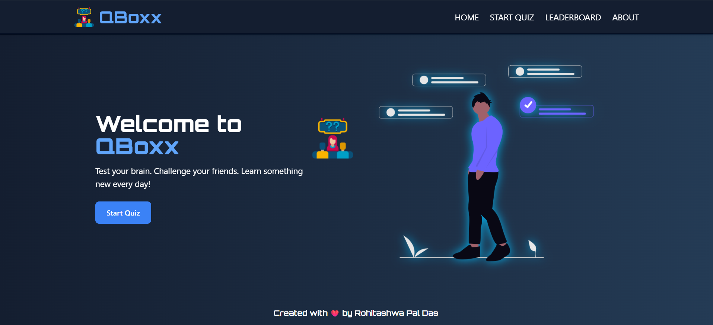
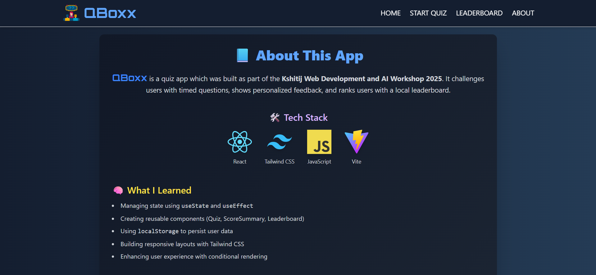
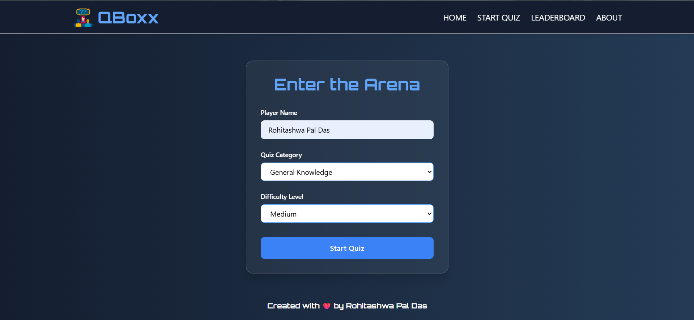
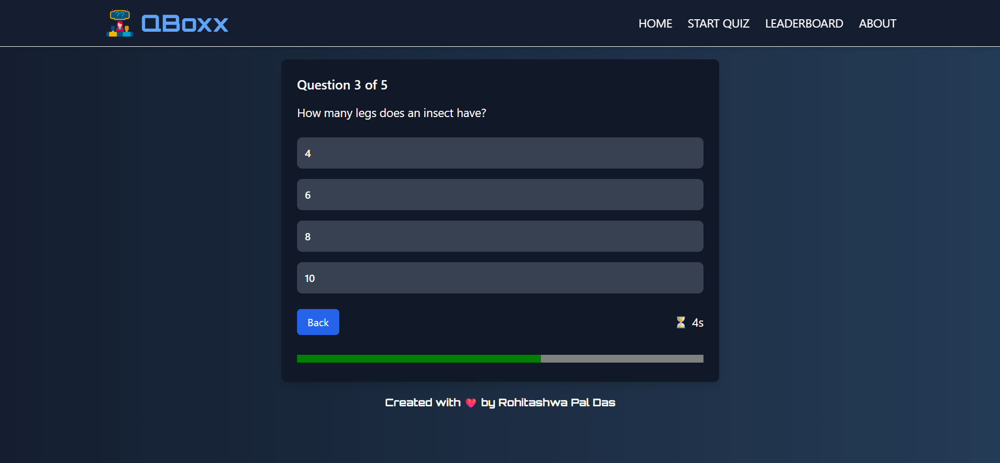
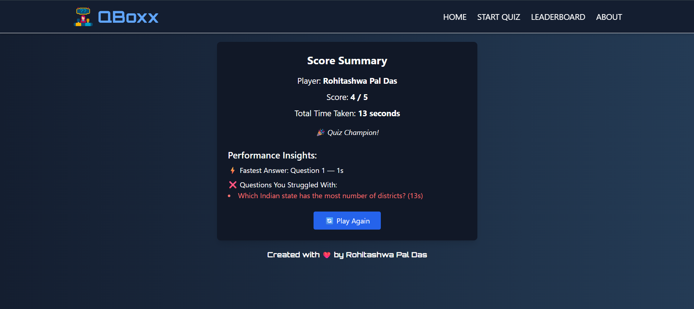
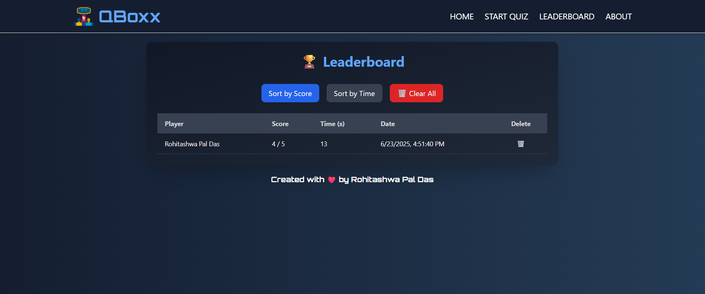

# 🧠 QBoxx - React Quiz Game App

A fully functional and responsive quiz game built using **React** and **Tailwind CSS**. This application was developed during the **Kshitij Web Development & AI Workshop 2025** with the goal of learning and applying modern web development skills in a real-world project.

---

## 📌 Features

- 🎮 **Dynamic Quiz Flow** with timer-based questions
- ⏳ **Score Summary** with player name, score, total time, and motivational messages
- 🏆 **Leaderboard** with sorting (score/time), individual & bulk delete functionality
- 💾 **LocalStorage Integration** for persistent score history
- 📱 **Responsive Design** supporting mobile, tablet, and desktop devices
- 🌙 **Dark Mode** modern UI powered by Tailwind CSS

---

## 🎮 How the Quiz Works

1. **Start Quiz**
   - Enter your name
   - Choose a quiz **category** and **difficulty level**
   - Click “Start Quiz” to begin

2. **During the Quiz**
   - Each question has a **15-second timer**
   - Select an answer before the timer ends
   - If unanswered, it’s marked incorrect and the next question appears

3. **After the Quiz**
   - View a **detailed summary** with score, time taken, and personalized message
   - Option to **play again**
   - If completed, data is stored in the **leaderboard**

4. **Leaderboard**
   - Displays all previous quiz attempts
   - Allows **sorting by score or time**
   - Includes **date**, **player name**, and ability to delete each record
   - Prevents incomplete attempts from being saved

---

## 📚 Categories & Difficulty Levels

### Available Categories:
- Science 🧪
- Sports
- General Knowledge 🧠
- Movies 🎬

### Difficulty Levels:
- Easy 🟢
- Medium 🟡
- Hard 🔴

The questions are stored in `src/data/questions.js` and are filtered based on selected category and difficulty and each level has 5 questions.

---

## 🧭 User Journey

| Step              | Component               |
|-------------------|-------------------------|
| Landing Page      | `Home.jsx`, `Hero.jsx`  |
| Player Setup      | `AddPlayerForm.jsx`     |
| Quiz Flow         | `Quizgame.jsx`          |
| Score Summary     | `ScoreSummary.jsx`      |
| Leaderboard View  | `Leaderboard.jsx`       |
| About the Project | `About.jsx`             |

---

## 🛠 Tech Stack

| Technology       | Purpose                              |
|------------------|--------------------------------------|
| **React (Vite)** | Frontend UI framework                |
| **Tailwind CSS** | Utility-first styling                |
| **JavaScript**   | Game logic and local storage ops     |
| **LocalStorage** | Store quiz history and preferences   |
| **Vite**         | Fast bundling and dev server         |

---

## 📸 Screenshots

| Quiz Screen | Score Summary | Leaderboard |
|-------------|---------------|-------------|
|  |  |  |  |  |  |

## 📁 Folder Structure

```
src/
├── assets/                 # Static assets (images, logos)
├── components/             # Reusable UI components
│   ├── AddPlayerForm.jsx
│   ├── ScoreSummary.jsx
│   ├── Navbar.jsx, Footer.jsx, Hero.jsx
├── data/
│   └── questions.js        # Quiz questions
├── pages/
│   ├── Home.jsx
│   ├── Quizgame.jsx
│   ├── Leaderboard.jsx
│   ├── Startquiz.jsx
│   └── About.jsx
├── App.jsx
└── main.jsx
```

---

## 📦 Installation & Setup

### 1. Clone the repository

```bash
git clone https://github.com/RohitashwaPalDas/KTJ-WEBD-WORKSHOP-Assignment3.git
cd react-quiz-game
```

### 2. Install dependencies

```bash
npm install
```

### 3. Run development server

```bash
npm run dev
```

Open your browser and navigate to `http://localhost:5173`

---

## 💾 Local Storage Usage

| Key               | Purpose                                |
|------------------|----------------------------------------|
| `playerData`      | Stores player’s name, category, and difficulty |
| `quizLeaderboard` | Stores an array of quiz results (score, time, date) |

---

## 📄 License

This project is licensed under the **MIT License**.  
Feel free to use and modify it for learning or personal use.

---

## 🙌 Acknowledgements

This app was created during the **Kshitij Web Development & AI Workshop 2025** as a hands-on learning project.

Special thanks to the instructors and fellow participants for the support and feedback throughout the development journey.

---

## 😂 Bonus Meme

> When you're 100% sure the answer is C... and it’s A:


---

## 📬 Contact

Created with ❤️ by Rohitashwa Pal Das, a proud participant of Kshitij 2025.  
If you'd like to connect or contribute, feel free to fork and enhance!
